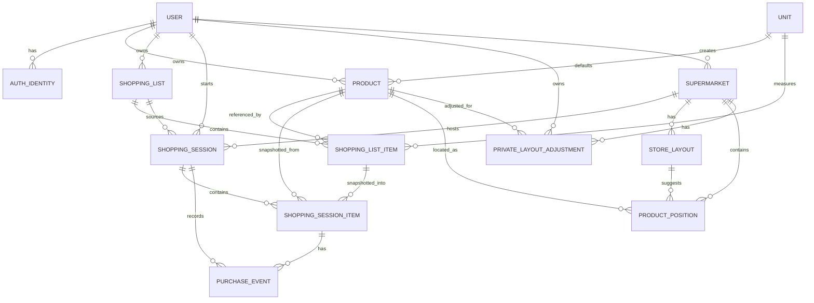

# ZBuy Conceptual Data Model

Date: 2026-05-20
Status: Prototype documentation

This document describes the conceptual data model for the ZBuy static prototype. It is not a production database schema. Field summaries are intentionally limited to the product concepts needed by journeys, screens, business rules, and future implementation planning.

## Overview

## Core Rules

### Snapshot Rule

Completed shopping history must not depend on mutable product or list records. A shopping session stores the source list name snapshot, so History remains accurate if the source list is renamed, archived, deleted, or duplicated later. A shopping session item stores the product name, category label snapshot, requested quantity, requested unit snapshot, actual quantity, actual unit snapshot, expected price, actual price, and outcome as they were during the session, so history remains accurate after reusable products or lists are edited, archived, deleted, or duplicated.

### Category Rule

For this prototype, category is a product/category label snapshot rather than a separate normalized entity. Future implementation may normalize categories, but this conceptual model intentionally does not add a CATEGORY entity.

### Unit Rule

Units are flexible catalog records. Initial examples include kg, g, unit, dozen, box, package, liter, ml, bundle, tray, can, and bottle. The catalog can expand later without schema changes.

### Price Rule

A product estimated price is a planning aid. A shopping list item expected price is the user's list expectation. A shopping session item actual price is the historical price paid during that session.

## Entity Definitions

### USER

Represents an app account and owner of private shopping data.

Conceptual fields:

- id
- name
- e-mail
- authentication methods
- location consent
- shared layout contribution consent
- privacy preferences
- created at
- updated at

### AUTH_IDENTITY

Represents a linked login method for a user, including Google, Microsoft, or native e-mail/password access.

Conceptual fields:

- id
- user id
- provider
- provider subject id
- e-mail
- created at

### PRODUCT

Represents a reusable user product used to build lists and seed category or location suggestions.

Conceptual fields:

- id
- owner user id
- name
- category label
- brand
- default unit
- estimated price
- notes
- archived at
- created at
- updated at

### UNIT

Represents a flexible unit of measure for products, list quantities, and session item snapshots.

Conceptual fields:

- id
- name
- abbreviation
- type
- allows decimals
- active

### SHOPPING_LIST

Represents a reusable named list template, such as weekly shopping, barbecue, monthly basics, or shopping for another person.

Conceptual fields:

- id
- owner user id
- name
- description
- status
- duplicated from list id
- created at
- updated at

### SHOPPING_LIST_ITEM

Represents an item inside a reusable list before a specific shopping session begins.

Conceptual fields:

- id
- list id
- product id
- quantity
- unit
- expected price
- priority
- notes
- sort order

### SHOPPING_SESSION

Represents one execution of a purchase using exactly one selected list, either in a physical supermarket or online.

Conceptual fields:

- id
- owner user id
- source list id
- source list name snapshot
- context
- supermarket id
- online context type
- online source label
- online context notes
- status
- started at
- completed at
- estimated total
- actual total

Online context type, online source label, and online context notes support History filtering and preserve the user's online shopping context after the session is completed.

### SHOPPING_SESSION_ITEM

Represents the historical snapshot of a list item during a shopping session.

Conceptual fields:

- id
- session id
- source list item id
- product id
- product name snapshot
- category label snapshot
- requested quantity
- requested unit snapshot
- actual quantity
- actual unit snapshot
- expected price
- actual price
- outcome
- notes

### SUPERMARKET

Represents a physical store that can be detected, manually chosen, or created during a physical shopping flow.

Conceptual fields:

- id
- name
- address label
- latitude
- longitude
- detection radius meters
- created by user id
- created at
- updated at

### STORE_LAYOUT

Represents a shared suggested layout for one supermarket.

Conceptual fields:

- id
- supermarket id
- version
- confidence score
- created at
- updated at

### PRIVATE_LAYOUT_ADJUSTMENT

Represents a user's private correction or note for a product or category position in a supermarket.

Conceptual fields:

- id
- user id
- supermarket id
- product id or category label
- position label
- notes
- created at
- updated at

### PRODUCT_POSITION

Represents an observed approximate product or category position in a supermarket layout.

Conceptual fields:

- id
- supermarket id
- product id or category label
- position label
- source
- confidence score
- last confirmed at
- created by user id

### PURCHASE_EVENT

Represents an auditable action recorded during a shopping session.

Conceptual fields:

- id
- session id
- session item id
- event type
- event payload
- created at

Examples of event types include bought, not found, price updated, position informed, position confirmed, supermarket confirmed, context changed, and session completed.
