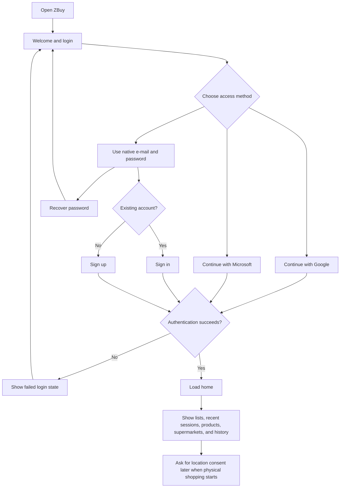
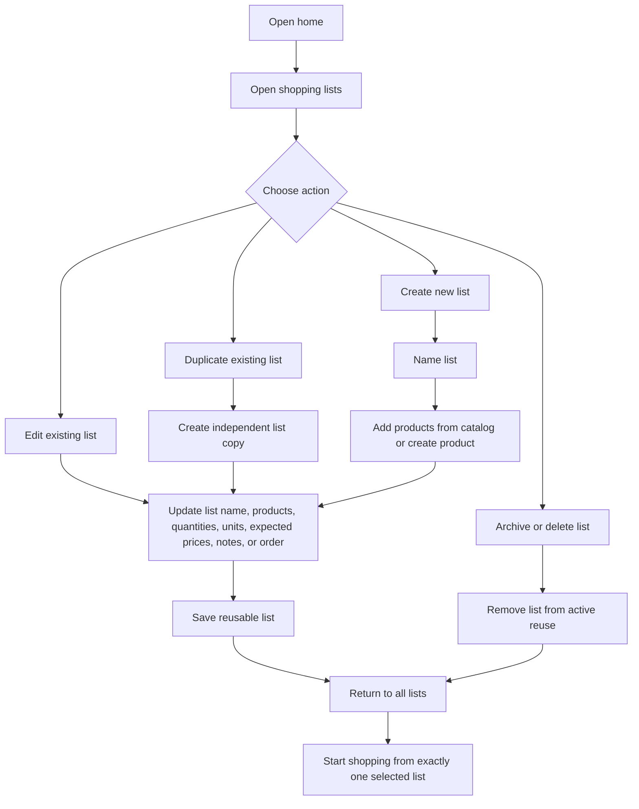
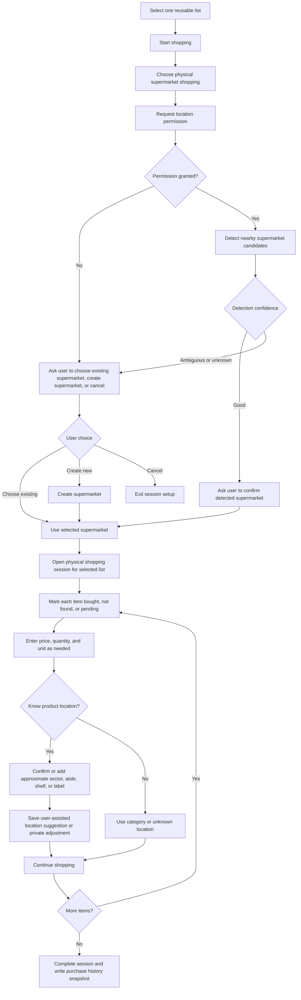
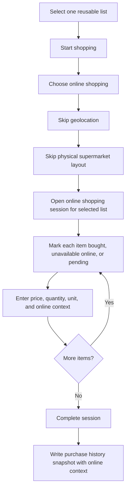
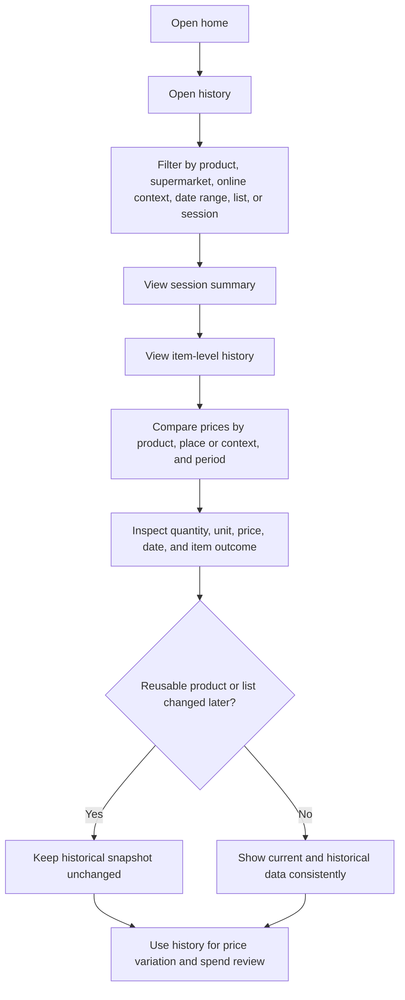

# ZBuy User Journey Map

Date: 2026-05-20
Status: Prototype documentation

This document maps the primary ZBuy user journeys for the static prototype. The journeys preserve the approved product decisions: reusable lists, one list per shopping session, physical supermarket support with user-assisted location data, a separate online shopping flow, and purchase history that remains accurate after reusable data changes.

## 1. First Access And Authentication

The user reaches ZBuy, chooses an authentication method, and grants optional permissions only when they are needed for a later flow.

Success criteria:

- The prototype offers Google, Microsoft, and native e-mail/password authentication.
- The native path supports sign in, sign up, password recovery, and failed login states.
- Location permission is not required for first access; it is requested in context before physical shopping.
- A successful login lands on the home screen with access to lists, products, supermarkets, sessions, history, and privacy settings.

## 2. Create And Reuse Lists

The user creates multiple reusable lists, edits them over time, and duplicates a list when they need an independent variant.

Success criteria:

- The user can maintain multiple reusable lists, such as weekly shopping, barbecue, monthly basics, or shopping for another person.
- List duplication creates an independent copy, so changing the duplicate does not alter the original list.
- Lists support products, quantities, units, expected prices, notes, ordering, archive, and delete actions.
- Starting a shopping session requires selecting exactly one list; using multiple lists in one session remains out of MVP scope.

## 3. Physical Shopping

The user starts a physical shopping session from one list, confirms or creates the supermarket, records item outcomes, and helps improve approximate product locations.

Success criteria:

- Physical shopping starts from exactly one selected list.
- The app requests geolocation for physical shopping and uses it to suggest nearby supermarkets.
- The user can confirm a detected supermarket, choose an existing supermarket, create a new supermarket, or cancel when the store is unknown or ambiguous.
- Product location is approximate and user-assisted, using labels such as sector, aisle, shelf, or other store-specific terms.
- The layout can combine shared suggested locations with private user adjustments.
- Completed physical sessions preserve item outcomes, prices, quantities, units, date, and supermarket context in history.

## 4. Online Shopping

The user starts an online shopping session from one list and records purchase outcomes without location or physical layout steps.

Success criteria:

- Online shopping starts from exactly one selected list.
- The online flow does not request geolocation.
- The online flow does not show or update physical supermarket layout.
- The user can record bought items, unavailable items, pending items, prices, quantities, units, and online context.
- The resulting history clearly identifies the session as online.

## 5. Review History And Prices

The user reviews past sessions, product prices, and spending context from immutable purchase records.

Success criteria:

- History preserves the product price, place or online context, date, quantity, and unit for each purchased item.
- History remains accurate even after reusable products are edited, archived, or deleted.
- History remains accurate even after reusable lists are edited, duplicated, archived, or deleted.
- The user can review items not found or unavailable, total estimated spend, total real spend, and price variation by supermarket or period.
- Physical sessions retain supermarket context, while online sessions retain online context without geolocation or layout data.
