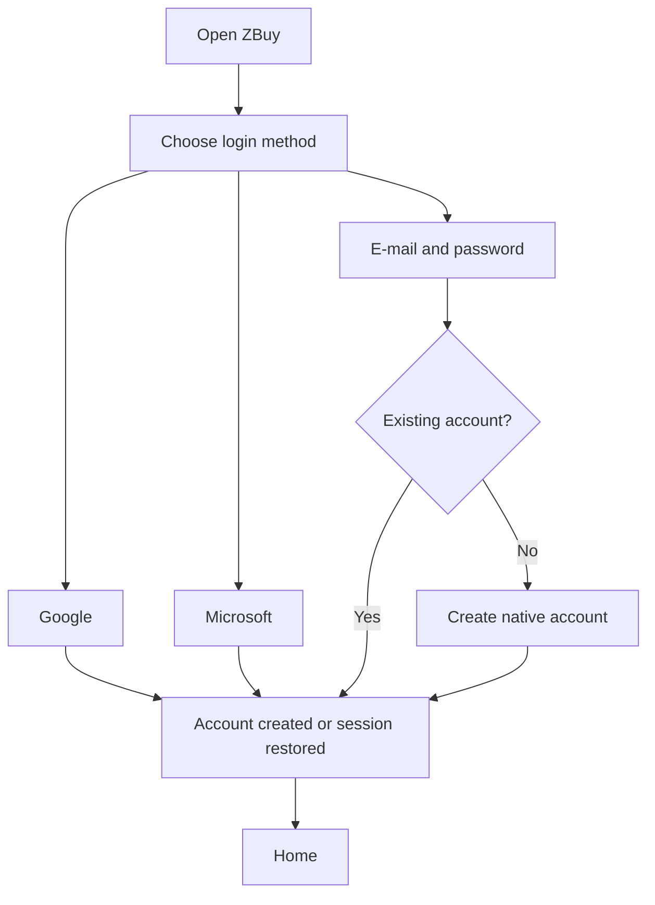
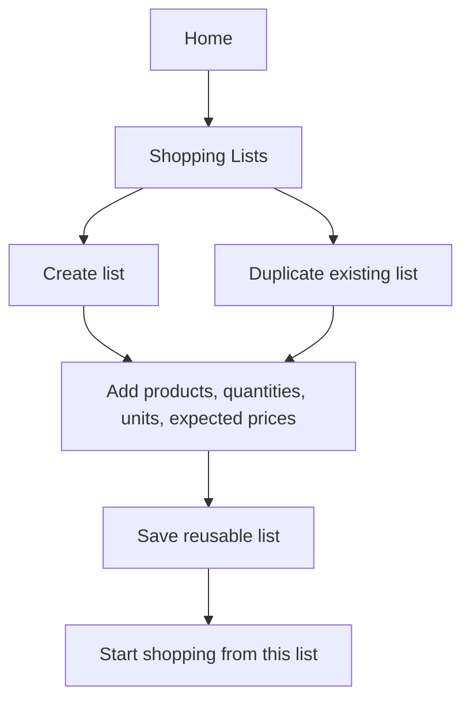
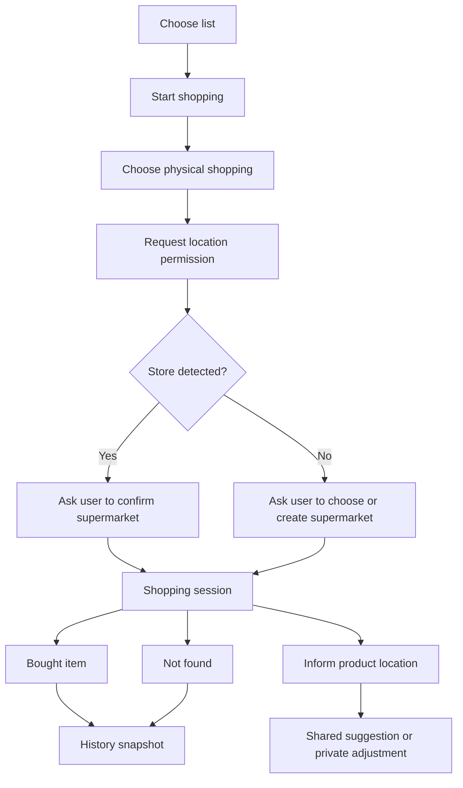
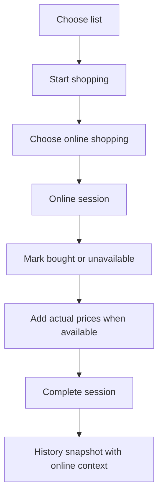
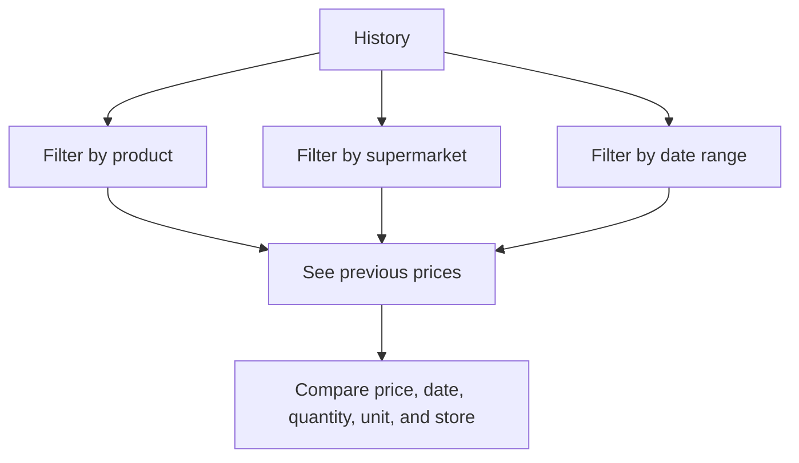
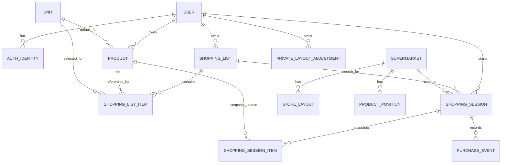

# ZBuy Prototype Documentation Implementation Plan

> **For agentic workers:** REQUIRED SUB-SKILL: Use superpowers:subagent-driven-development (recommended) or superpowers:executing-plans to implement this plan task-by-task. Steps use checkbox (`- [ ]`) syntax for tracking.

**Goal:** Build a complete product prototype documentation package for ZBuy before creating the production application.

**Architecture:** This phase creates documentation and static prototype artifacts only. The output is organized by product concern: journeys, screen inventory, wireframes, data model, business rules, edge states, and future implementation plan.

**Tech Stack:** Markdown documentation, Mermaid diagrams, static HTML wireframe/prototype pages, Git.

---

## File Structure

- Create: `docs/product/README.md`
  - Index for all product prototype documentation and reading order.
- Create: `docs/product/journeys.md`
  - User journeys for authentication, list creation, physical shopping, online shopping, product location, and history review.
- Create: `docs/product/screens.md`
  - Screen inventory with purpose, primary actions, data shown, empty states, and error states.
- Create: `docs/product/data-model.md`
  - Conceptual data model with entities, fields, relationships, and history snapshot rules.
- Create: `docs/product/business-rules.md`
  - Business rules for lists, sessions, products, pricing, layout, geolocation, and privacy.
- Create: `docs/product/wireframes/index.html`
  - Static browser prototype entry point.
- Create: `docs/product/wireframes/styles.css`
  - Shared visual system for wireframes.
- Create: `docs/product/wireframes/app.js`
  - Small client-side navigation for wireframe screens.
- Create: `docs/product/implementation-roadmap.md`
  - Future phased implementation roadmap after prototype approval.

Existing context:

- Read: `docs/superpowers/specs/2026-05-20-zbuy-prototype-design.md`
- Keep: `docs/brainstorm/mvp-flow.html`

---

### Task 1: Product Documentation Index

**Files:**
- Create: `docs/product/README.md`

- [ ] **Step 1: Create the documentation index**

Create `docs/product/README.md` with this content:

```markdown
# ZBuy Product Prototype

This folder contains the product prototype documentation for ZBuy. It describes the app before production implementation begins.

## Reading Order

1. [Journeys](journeys.md)
2. [Screens](screens.md)
3. [Data Model](data-model.md)
4. [Business Rules](business-rules.md)
5. [Wireframes](wireframes/index.html)
6. [Implementation Roadmap](implementation-roadmap.md)

## Source Spec

The approved source specification is:

`docs/superpowers/specs/2026-05-20-zbuy-prototype-design.md`

## Prototype Scope

The first phase documents a responsive web prototype. It does not implement the production application, backend, authentication providers, database, or geolocation service.
```

- [ ] **Step 2: Verify the file exists**

Run:

```powershell
Test-Path docs\product\README.md
```

Expected output:

```text
True
```

- [ ] **Step 3: Commit**

Run:

```powershell
git add docs/product/README.md
git commit -m "docs: add product prototype index"
```

Expected: commit succeeds.

---

### Task 2: User Journey Map

**Files:**
- Create: `docs/product/journeys.md`

- [ ] **Step 1: Create the journey map document**

Create `docs/product/journeys.md` with sections for these journeys:

````markdown
# ZBuy User Journeys

## Journey 1: First Access And Authentication



Success criteria:

- User can understand all three authentication options.
- Native account is a first-class option, not a fallback hidden behind social login.
- Location consent is requested only when the user starts a physical shopping flow.

## Journey 2: Create And Reuse Lists



Success criteria:

- User can create more than one list.
- User can duplicate a list and edit the copy independently.
- Starting a shopping session does not destroy or empty the reusable list.

## Journey 3: Physical Shopping



Success criteria:

- Supermarket is confirmed before layout contributions are recorded.
- Product location is approximate and user-assisted.
- Bought and not-found items leave the active session view but remain in history.

## Journey 4: Online Shopping



Success criteria:

- Online shopping never asks for supermarket geolocation.
- Online shopping does not update physical layouts.
- History preserves that the purchase was online.

## Journey 5: Review History And Prices



Success criteria:

- User can see what they paid for each product.
- User can see where and when each product was bought.
- History remains accurate even if lists or products are edited later.
````

- [ ] **Step 2: Verify Mermaid blocks are present**

Run:

```powershell
Select-String -Path docs\product\journeys.md -Pattern "flowchart TD" | Measure-Object
```

Expected: `Count` is `5`.

- [ ] **Step 3: Commit**

Run:

```powershell
git add docs/product/journeys.md
git commit -m "docs: add ZBuy user journeys"
```

Expected: commit succeeds.

---

### Task 3: Screen Inventory

**Files:**
- Create: `docs/product/screens.md`

- [ ] **Step 1: Create screen inventory**

Create `docs/product/screens.md` with one section per screen:

```markdown
# ZBuy Screen Inventory

## Welcome And Login

Purpose: authenticate the user.

Primary actions:

- Continue with Google.
- Continue with Microsoft.
- Sign in with e-mail and password.
- Create native account.
- Recover password.

States:

- Initial.
- Login failed.
- Account creation validation error.
- Password recovery sent.

## Home

Purpose: show the user's current product state and entry points.

Primary actions:

- Create list.
- Duplicate list.
- Start shopping.
- Open products.
- Open supermarkets.
- Open history.

Data shown:

- Recent lists.
- Recent sessions.
- Last confirmed supermarket.
- Recent price/history highlights.

## Products

Purpose: manage reusable products.

Primary actions:

- Create product.
- Edit product.
- Archive product.
- Search products.
- View product price history.

Data shown:

- Name.
- Category.
- Brand.
- Default unit.
- Estimated price.

## Product Form

Purpose: capture reusable product details.

Fields:

- Name.
- Category.
- Brand.
- Default unit.
- Estimated/default price.
- Notes.

Validation:

- Name is required.
- Default unit is required.
- Estimated price must be numeric when provided.

## Shopping Lists

Purpose: manage reusable named lists.

Primary actions:

- Create list.
- Edit list.
- Duplicate list.
- Archive list.
- Delete list.
- Start shopping from a list.

Data shown:

- List name.
- Item count.
- Last used date.
- Status.

## List Editor

Purpose: edit products and quantities in a reusable list.

Fields per item:

- Product.
- Quantity.
- Unit.
- Expected price.
- Notes.
- Priority.

## Shopping Context

Purpose: choose between physical and online shopping for one selected list.

Primary actions:

- Start physical shopping.
- Start online shopping.
- Cancel.

## Supermarket Confirmation

Purpose: confirm or create the physical supermarket detected by geolocation.

Primary actions:

- Confirm detected supermarket.
- Choose another supermarket.
- Create supermarket.
- Cancel physical shopping.

States:

- One confident match.
- Multiple possible matches.
- No match.
- Location denied.
- Location imprecise.

## Physical Shopping Session

Purpose: execute a shopping session inside one confirmed supermarket.

Primary actions:

- Mark item bought.
- Mark item not found.
- Enter actual price.
- Inform product location.
- Finish session.

## Product Location Form

Purpose: capture approximate location for a product.

Fields:

- Sector.
- Aisle.
- Shelf or position label.
- Visibility: private adjustment or shared contribution.
- Notes.

## Supermarket Layout

Purpose: show known and uncertain product/category positions.

Data shown:

- Shared layout suggestions.
- Private adjustments.
- Product positions.
- Confidence indicators.
- Last confirmed dates.

## Online Shopping Session

Purpose: execute a shopping session without physical location.

Primary actions:

- Mark item bought.
- Mark item unavailable online.
- Enter actual price.
- Finish session.

## History

Purpose: review previous purchases and product prices.

Filters:

- Product.
- Supermarket.
- Online context.
- Date range.
- List.

Data shown:

- Session date.
- Context.
- Store or online source.
- Product.
- Quantity and unit.
- Actual price.
- Outcome.

## Account And Privacy

Purpose: manage account, authentication methods, and privacy settings.

Primary actions:

- Update profile.
- Manage login methods.
- Toggle location consent.
- Toggle shared layout contribution.
- Export data.
- Delete account.
```

- [ ] **Step 2: Verify required screens are documented**

Run:

```powershell
Select-String -Path docs\product\screens.md -Pattern "^## " | Measure-Object
```

Expected: `Count` is `14`.

- [ ] **Step 3: Commit**

Run:

```powershell
git add docs/product/screens.md
git commit -m "docs: add ZBuy screen inventory"
```

Expected: commit succeeds.

---

### Task 4: Data Model Documentation

**Files:**
- Create: `docs/product/data-model.md`

- [ ] **Step 1: Create data model document**

Create `docs/product/data-model.md` using the entities from the approved spec:

````markdown
# ZBuy Conceptual Data Model

## Entity Relationship Overview



## Snapshot Rule

Completed shopping history must not depend on mutable product or list records. `SHOPPING_SESSION_ITEM` stores the product name, category, quantity, unit, expected price, actual price, and outcome as they were during the session.

## Unit Rule

Units are flexible catalog records. The initial catalog includes kg, g, unit, dozen, box, package, liter, ml, bundle, tray, can, and bottle. The catalog can expand later without schema changes.

## Price Rule

`PRODUCT.estimated_price` is a planning aid. `SHOPPING_LIST_ITEM.expected_price` is the list expectation. `SHOPPING_SESSION_ITEM.actual_price` is the historical price paid.

## Entity Definitions

Use the approved spec as the source for fields:

- User.
- Auth Identity.
- Product.
- Unit.
- Shopping List.
- Shopping List Item.
- Shopping Session.
- Shopping Session Item.
- Supermarket.
- Store Layout.
- Private Layout Adjustment.
- Product Position.
- Purchase Event.
````

- [ ] **Step 2: Verify core rules are present**

Run:

```powershell
Select-String -Path docs\product\data-model.md -Pattern "Snapshot Rule|Unit Rule|Price Rule"
```

Expected: three matches.

- [ ] **Step 3: Commit**

Run:

```powershell
git add docs/product/data-model.md
git commit -m "docs: add ZBuy conceptual data model"
```

Expected: commit succeeds.

---

### Task 5: Business Rules Documentation

**Files:**
- Create: `docs/product/business-rules.md`

- [ ] **Step 1: Create business rules document**

Create `docs/product/business-rules.md` with grouped rules:

```markdown
# ZBuy Business Rules

## Authentication

1. Users can authenticate with Google, Microsoft, or native e-mail/password.
2. Native account support must be visible in the main login experience.
3. Location consent is not required for online shopping.

## Lists

1. Users can create multiple named lists.
2. Users can duplicate a list into an independent copy.
3. A shopping session uses one list.
4. Multiple simultaneous lists in one session are out of MVP scope.
5. Completing a session does not delete or empty the source list.

## Products And Units

1. Product name and default unit are required.
2. Unit is selected from a flexible catalog.
3. Estimated product price is optional.
4. Actual price is recorded per shopping session item.

## Physical Shopping

1. The app asks for geolocation only when physical shopping starts.
2. The user must confirm a supermarket before layout data is recorded.
3. Low-confidence or ambiguous store detection requires manual user choice.
4. Product position is approximate and user-assisted.

## Online Shopping

1. Online shopping is a separate context.
2. Online shopping does not update physical store layouts.
3. Online history records an online source label when available.

## Layouts

1. Shared layout suggestions require consent.
2. Private adjustments remain private to the user.
3. Product positions include confidence and last confirmation metadata.

## History

1. Each session preserves item snapshots.
2. Historical prices must remain accurate after product or list edits.
3. Users can filter history by product, supermarket, online context, date range, and list.

## Privacy

1. Purchase history is private by default.
2. Shared layout data must not expose user identity.
3. Account deletion must define handling for private history and anonymized shared contributions.
```

- [ ] **Step 2: Verify no MVP-forbidden parallel-list feature is included**

Run:

```powershell
Select-String -Path docs\product\business-rules.md -Pattern "Multiple simultaneous lists in one session are out of MVP scope"
```

Expected: one match.

- [ ] **Step 3: Commit**

Run:

```powershell
git add docs/product/business-rules.md
git commit -m "docs: add ZBuy business rules"
```

Expected: commit succeeds.

---

### Task 6: Static Wireframe Prototype

**Files:**
- Create: `docs/product/wireframes/index.html`
- Create: `docs/product/wireframes/styles.css`
- Create: `docs/product/wireframes/app.js`

- [ ] **Step 1: Create the HTML shell**

Create `docs/product/wireframes/index.html` with navigation for all core screens:

```html
<!doctype html>
<html lang="pt-BR">
  <head>
    <meta charset="utf-8" />
    <meta name="viewport" content="width=device-width, initial-scale=1" />
    <title>ZBuy Wireframes</title>
    <link rel="stylesheet" href="styles.css" />
  </head>
  <body>
    <aside class="sidebar">
      <h1>ZBuy</h1>
      <button data-screen="home">Início</button>
      <button data-screen="login">Login</button>
      <button data-screen="lists">Listas</button>
      <button data-screen="list-editor">Editor de Lista</button>
      <button data-screen="products">Produtos</button>
      <button data-screen="context">Contexto</button>
      <button data-screen="physical">Compra Física</button>
      <button data-screen="layout">Layout</button>
      <button data-screen="online">Compra Online</button>
      <button data-screen="history">Histórico</button>
      <button data-screen="privacy">Conta</button>
    </aside>
    <main id="app" class="screen"></main>
    <script src="app.js"></script>
  </body>
</html>
```

- [ ] **Step 2: Create shared styles**

Create `docs/product/wireframes/styles.css`:

```css
:root {
  --bg: #f6f7f4;
  --panel: #ffffff;
  --ink: #1d2420;
  --muted: #667069;
  --line: #d9ded7;
  --accent: #1f8f5f;
}

* {
  box-sizing: border-box;
}

body {
  margin: 0;
  min-height: 100vh;
  display: grid;
  grid-template-columns: 240px 1fr;
  background: var(--bg);
  color: var(--ink);
  font-family: Inter, ui-sans-serif, system-ui, -apple-system, BlinkMacSystemFont, "Segoe UI", sans-serif;
}

.sidebar {
  border-right: 1px solid var(--line);
  background: var(--panel);
  padding: 20px;
}

.sidebar h1 {
  margin: 0 0 20px;
  font-size: 26px;
}

.sidebar button {
  width: 100%;
  border: 1px solid var(--line);
  background: #fff;
  color: var(--ink);
  border-radius: 8px;
  padding: 10px 12px;
  margin-bottom: 8px;
  text-align: left;
  cursor: pointer;
}

.sidebar button.active {
  border-color: var(--accent);
  background: #e4f5ec;
}

.screen {
  padding: 28px;
}

.grid {
  display: grid;
  grid-template-columns: repeat(2, minmax(0, 1fr));
  gap: 16px;
}

.panel {
  background: var(--panel);
  border: 1px solid var(--line);
  border-radius: 8px;
  padding: 18px;
}

.toolbar {
  display: flex;
  gap: 10px;
  flex-wrap: wrap;
  margin: 16px 0;
}

.button {
  border: 0;
  border-radius: 8px;
  background: var(--accent);
  color: white;
  padding: 10px 14px;
  font-weight: 700;
}

.muted {
  color: var(--muted);
}

.list {
  display: grid;
  gap: 10px;
}

.row {
  display: flex;
  justify-content: space-between;
  gap: 12px;
  border: 1px solid var(--line);
  border-radius: 8px;
  padding: 12px;
}

@media (max-width: 820px) {
  body {
    grid-template-columns: 1fr;
  }

  .sidebar {
    border-right: 0;
    border-bottom: 1px solid var(--line);
  }

  .grid {
    grid-template-columns: 1fr;
  }
}
```

- [ ] **Step 3: Create screen renderer**

Create `docs/product/wireframes/app.js` with screen content for the prototype:

```javascript
const screens = {
  home: `
    <h2>Início</h2>
    <p class="muted">Listas recentes, sessões recentes e ações principais.</p>
    <div class="toolbar"><button class="button">Criar lista</button><button class="button">Começar compra</button></div>
    <div class="grid">
      <section class="panel"><h3>Listas</h3><div class="list"><div class="row"><span>Compra da semana</span><strong>18 itens</strong></div><div class="row"><span>Churrasco</span><strong>9 itens</strong></div></div></section>
      <section class="panel"><h3>Histórico recente</h3><div class="list"><div class="row"><span>Mercado Central</span><strong>R$ 246,80</strong></div><div class="row"><span>Online</span><strong>R$ 91,20</strong></div></div></section>
    </div>
  `,
  login: `
    <h2>Login</h2>
    <section class="panel"><div class="toolbar"><button class="button">Continuar com Google</button><button class="button">Continuar com Microsoft</button><button class="button">Entrar com e-mail</button></div><p class="muted">Conta própria permanece visível como opção principal.</p></section>
  `,
  lists: `
    <h2>Listas de Compras</h2>
    <div class="toolbar"><button class="button">Nova lista</button><button class="button">Duplicar selecionada</button></div>
    <section class="panel list"><div class="row"><span>Compra da semana</span><span>Editar | Duplicar | Comprar</span></div><div class="row"><span>Casa da mãe</span><span>Editar | Duplicar | Comprar</span></div></section>
  `,
  "list-editor": `
    <h2>Editor de Lista</h2>
    <section class="panel list"><div class="row"><span>Arroz - 5 kg - esperado R$ 28,00</span><span>Remover</span></div><div class="row"><span>Leite - 12 unidades - esperado R$ 72,00</span><span>Remover</span></div><div class="row"><span>Banana - 2 kg - esperado R$ 14,00</span><span>Remover</span></div></section>
  `,
  products: `
    <h2>Produtos</h2>
    <div class="toolbar"><button class="button">Novo produto</button></div>
    <section class="panel list"><div class="row"><span>Arroz | kg | preço estimado R$ 5,60/kg</span><span>Histórico</span></div><div class="row"><span>Leite | unidade | preço estimado R$ 6,00</span><span>Histórico</span></div></section>
  `,
  context: `
    <h2>Escolha de Contexto</h2>
    <div class="grid"><section class="panel"><h3>Compra física</h3><p>Usa localização para confirmar supermercado.</p><button class="button">Usar geolocalização</button></section><section class="panel"><h3>Compra online</h3><p>Não usa layout físico nem geolocalização.</p><button class="button">Comprar online</button></section></div>
  `,
  physical: `
    <h2>Compra Física</h2>
    <p class="muted">Supermercado confirmado: Mercado Central.</p>
    <section class="panel list"><div class="row"><span>Arroz - Corredor 4</span><span>Preço | Comprado | Não encontrado</span></div><div class="row"><span>Banana - Hortifruti</span><span>Preço | Comprado | Não encontrado</span></div></section>
  `,
  layout: `
    <h2>Layout do Supermercado</h2>
    <div class="grid"><section class="panel"><h3>Compartilhado</h3><p>Hortifruti: banana, maçã, tomate</p><p>Corredor 4: arroz, feijão</p></section><section class="panel"><h3>Ajustes privados</h3><p>Leite movido para corredor 7 neste usuário.</p></section></div>
  `,
  online: `
    <h2>Compra Online</h2>
    <section class="panel list"><div class="row"><span>Leite - 12 unidades</span><span>Preço | Comprado | Indisponível</span></div><div class="row"><span>Café - 2 pacotes</span><span>Preço | Comprado | Indisponível</span></div></section>
  `,
  history: `
    <h2>Histórico</h2>
    <section class="panel list"><div class="row"><span>Arroz | Mercado Central | 5 kg | R$ 28,00 | 20/05/2026</span><span>Ver sessão</span></div><div class="row"><span>Leite | Online | 12 un | R$ 72,00 | 20/05/2026</span><span>Ver sessão</span></div></section>
  `,
  privacy: `
    <h2>Conta e Privacidade</h2>
    <section class="panel list"><div class="row"><span>Consentimento de localização</span><strong>Ativo</strong></div><div class="row"><span>Contribuição para layout compartilhado</span><strong>Desativado</strong></div><div class="row"><span>Histórico privado</span><strong>Ativo</strong></div></section>
  `
};

const app = document.getElementById("app");
const buttons = Array.from(document.querySelectorAll("[data-screen]"));

function render(screen) {
  app.innerHTML = screens[screen];
  buttons.forEach((button) => {
    button.classList.toggle("active", button.dataset.screen === screen);
  });
}

buttons.forEach((button) => {
  button.addEventListener("click", () => render(button.dataset.screen));
});

render("home");
```

- [ ] **Step 4: Verify static files exist**

Run:

```powershell
Test-Path docs\product\wireframes\index.html; Test-Path docs\product\wireframes\styles.css; Test-Path docs\product\wireframes\app.js
```

Expected output:

```text
True
True
True
```

- [ ] **Step 5: Open and click through the prototype**

Open:

```text
file:///C:/Users/junio/Documents/zbuy/docs/product/wireframes/index.html
```

Expected:

- Sidebar navigation changes the active screen.
- Home, Login, Lists, List Editor, Products, Context, Physical Shopping, Layout, Online Shopping, History, and Account screens render.
- No screen shows a blank main area.

- [ ] **Step 6: Commit**

Run:

```powershell
git add docs/product/wireframes
git commit -m "docs: add static ZBuy wireframes"
```

Expected: commit succeeds.

---

### Task 7: Future Implementation Roadmap

**Files:**
- Create: `docs/product/implementation-roadmap.md`

- [ ] **Step 1: Create roadmap**

Create `docs/product/implementation-roadmap.md`:

```markdown
# ZBuy Implementation Roadmap

## Phase 1: Prototype Documentation

Deliverables:

- User journeys.
- Screen inventory.
- Conceptual data model.
- Business rules.
- Static wireframes.

Exit criteria:

- Product owner approves the documented flows.
- No core screen has undefined purpose, primary action, or error state.

## Phase 2: Production Foundation

Deliverables:

- Web app scaffold.
- Custom backend scaffold.
- Database schema.
- Native account authentication.
- Google and Microsoft OAuth integration.

Exit criteria:

- User can create an account and sign in.
- User data is persisted.

## Phase 3: Lists And Products

Deliverables:

- Product catalog.
- Flexible units.
- Reusable shopping lists.
- List duplication.

Exit criteria:

- User can create, duplicate, edit, and reuse lists.

## Phase 4: Shopping Sessions And History

Deliverables:

- Physical and online session flows.
- Session item snapshots.
- Price capture.
- History filters.

Exit criteria:

- User can see past product prices by supermarket, online context, and date.

## Phase 5: Supermarket Detection And Layout

Deliverables:

- Geolocation-based supermarket detection.
- Manual supermarket confirmation.
- Approximate product location capture.
- Shared layout suggestions.
- Private layout adjustments.

Exit criteria:

- User can confirm a store and record product positions.
- Private and shared layout behavior follows consent settings.

## Deferred Features

- Offline support.
- Native mobile app.
- Multiple simultaneous lists in one session.
- Barcode scanning.
- Receipt scanning.
- Precise indoor positioning with store infrastructure.
```

- [ ] **Step 2: Verify roadmap phases**

Run:

```powershell
Select-String -Path docs\product\implementation-roadmap.md -Pattern "^## Phase" | Measure-Object
```

Expected: `Count` is `5`.

- [ ] **Step 3: Commit**

Run:

```powershell
git add docs/product/implementation-roadmap.md
git commit -m "docs: add ZBuy implementation roadmap"
```

Expected: commit succeeds.

---

### Task 8: Final Prototype Documentation Review

**Files:**
- Modify: `docs/product/README.md`

- [ ] **Step 1: Check for forbidden placeholders**

Run:

```powershell
Select-String -Path docs\product\*.md,docs\product\wireframes\*.html,docs\product\wireframes\*.css,docs\product\wireframes\*.js -Pattern "T[B]D|TO[D]O|placehold[e]r|implement late[r]|fill in detail[s]"
```

Expected: no matches.

- [ ] **Step 2: Check documentation coverage against approved spec**

Run:

```powershell
Select-String -Path docs\product\*.md -Pattern "Google|Microsoft|e-mail|duplic|geolocation|online|history|price|unit|layout|privacy"
```

Expected: matches across the product documentation files.

- [ ] **Step 3: Add completion note to index**

Append this section to `docs/product/README.md`:

```markdown

## Prototype Documentation Status

The prototype package includes journeys, screens, data model, business rules, static wireframes, and implementation roadmap. It is ready for product review before production implementation planning.
```

- [ ] **Step 4: Commit final documentation review**

Run:

```powershell
git add docs/product
git commit -m "docs: mark ZBuy prototype docs ready for review"
```

Expected: commit succeeds.

---

## Self-Review Checklist

- Spec coverage:
  - Authentication: Task 2, Task 3, Task 5, Task 6.
  - Multiple reusable lists and duplication: Task 2, Task 3, Task 5, Task 6.
  - One list per session: Task 2, Task 5.
  - Products, units, and prices: Task 3, Task 4, Task 5, Task 6.
  - Physical shopping and geolocation: Task 2, Task 3, Task 5, Task 6.
  - Online shopping: Task 2, Task 3, Task 5, Task 6.
  - Layout shared/private behavior: Task 2, Task 3, Task 4, Task 5, Task 6.
  - Purchase history: Task 2, Task 3, Task 4, Task 5, Task 6.
  - Privacy and consent: Task 3, Task 5, Task 6.
  - Future roadmap: Task 7.
- Placeholder scan: run Task 8 Step 1.
- Type consistency:
  - Shopping session, shopping session item, product, unit, supermarket, layout, and purchase event names match the approved spec.
